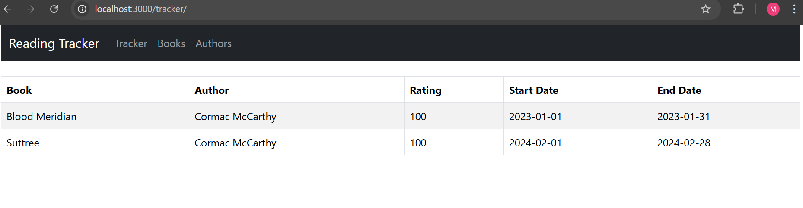
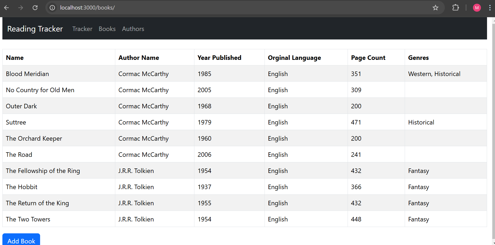
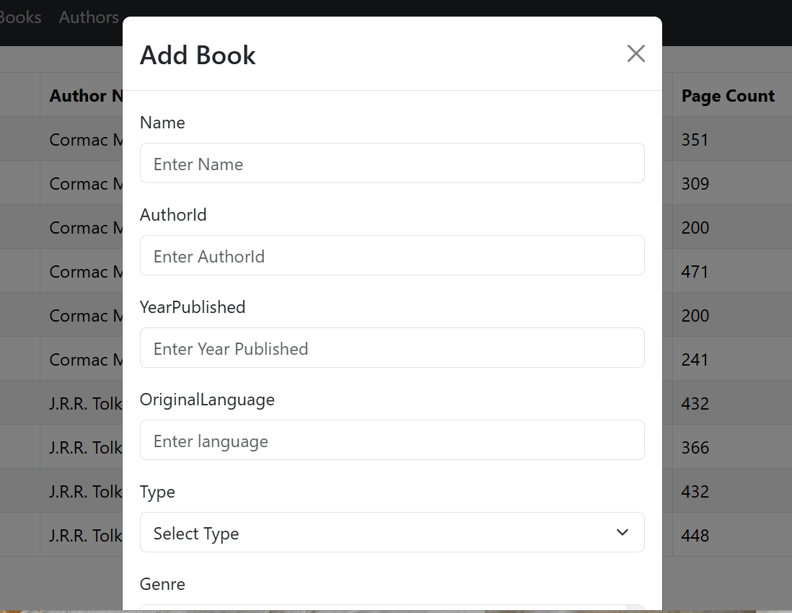

A react frontend and a ASP.NET backend for keeping track of your reading.

## Getting Started

Requirements:

* Docker Desktop

Launching locally:

```
docker compose up
```

Frontend: http://localhost:3000/

Backend: http://localhost:5099/swagger/index.html

Home Page


Book List


Add Book Modal

